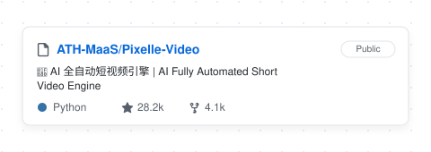

 

&nbsp;

&nbsp;

 

  

 

&nbsp;

&nbsp;

 

 

 

&nbsp;&nbsp;

  

&nbsp;

&nbsp;

 

 

 

<table border="0" cellspacing="0" cellpadding="10">
  <tr>
    <td align="center">
      
    </td>
    <td align="center">
      
    </td>
  </tr>
</table>

 

 

 

 

 

 

<table border="0" cellspacing="0" cellpadding="10">
  <tr>
    <td align="center">
      
    </td>
    <td align="center">
      
    </td>
  </tr>
</table>

 

 

 

<picture>
  <source media="(prefers-color-scheme: dark)" srcset="https://raw.githubusercontent.com/AuroraChloe/AuroraChloe/output/github-contribution-grid-snake-dark.svg"/>
  <source media="(prefers-color-scheme: light)" srcset="https://raw.githubusercontent.com/AuroraChloe/AuroraChloe/output/github-contribution-grid-snake.svg"/>
  
</picture>

 

 

